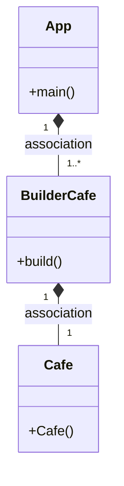
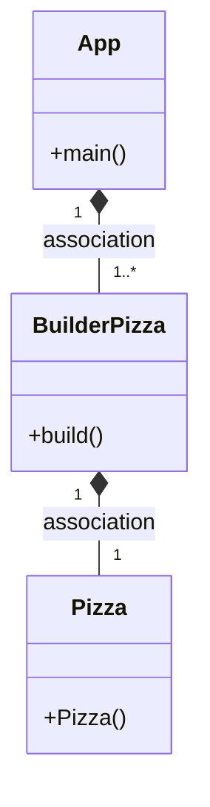

## Preguntas examen

### Funcion patrón builder
Poder construir estructuras complejas. Podemos instanciar diferentes objetos haciendo uso de la propia construcción.

### Ejemplo
Podríamos hacer una clase Cafe con diferentes atributos como: 
- cortado, largo, manchado
- solo, conLeche, conLecheSoja, conLecheAvena, conLecheCondensada
- descafeinado
- grande, mediano, pequeño
- conAzucar, conSacarina, sinNada

Así que tendríamos:
- #### Clase Cafe
Declaramos todos los atributos, los getters y setters de cada uno y método toString().
- #### Clase Buildercafe
Declaramos como privado un objeto de la clase Cafe, luego tendríamos el constructor y el método build() que nos devuelve un objeto de clase Cafe, el resto de métodos de esta clase
son los setter de los atributos de la clase pizza pero que devuelven objetos de tipo BuilderCafe.
- #### Clase Main
Creamos los objetos que queramos. Por ejemplo:

    Cafe cafeBombon = new BuilderCafe()
            .setTipoLeche(Cafe.CONDENSADA)
            .setTamano(Cafe.GRANDE)
            .build();
Estamos creando un objeto Cafe, con leche condensada y de tamaño grande, el resto de los atributos toman el valor por defecto que hayamos definido en el constructor, es decir, si nosotros en el cosntructor 
por defecto pusieramos que el café es de tamaño pequeño, si no lo definimos al crear el objeto, nos creará un café pequeño.
Los setter nos devuelven un objeto BuilderCafe por lo tanto podemos usar la sintaxis escrita anteriorme, lo más importante de esto
es el método build() que nos devuelve un objeto de tipo Cafe.

### Diagrama de clases del ejemplo

Este patrón lo podríamos combinar con el patrón Factory, ya que con este podemos instanciar un objeto dependiendo de lo que necesitemos, por lo tanto,
con el ejemplo que hemos puesto antes de café, si tenemos
varias bebidas para poder elegir instanciamos la que nos interesa y esta puede
usar el patrón builder para poder construir el objeto de la forma
en la que nosotros queramos.
## Diagrama de clases
