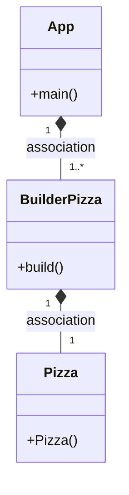

```mermaid
classDiagram
    App "1" *-- "1..*" BuilderPizza : association 
    class App{
        +main()
    }
    class BuilderPizza{
        +build()
    }
    BuilderPizza "1" *-- "1" Pizza : association
    class Pizza{
        +Pizza()
    }
```