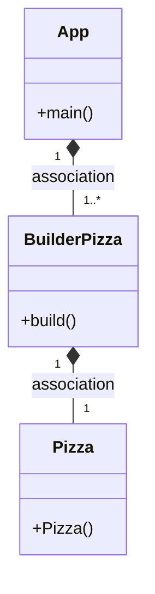

## Preguntas examen

### Funcion patrón builder
Poder construir estructuras complejas. Podemos instanciar diferentes objetos haciendo uso de la propia construcción.

### Ejemplo
Podríamos hacer una clase Cafe con diferentes atributos como: 
- cortado, largo, manchado
- solo, conLeche, conLecheSoja, conLecheAvena
- descafeinado
- grande, mediano, pequeño

Este patrón lo podríamos combinar con el patrón Factory, ya que con este podemos instanciar un objeto dependiendo de lo que necesitemos, por lo tanto,
con el ejemplo que hemos puesto antes de café, si tenemos
varias bebidas para poder elegir instanciamos la que nos interesa y esta puede
usar el patrón builder para poder construir el objeto de la forma
en la que nosotros queramos.
## Diagrama de clases
